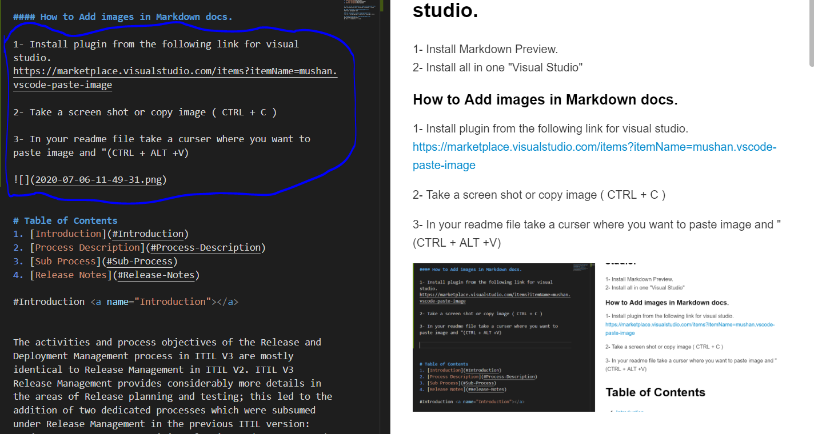

@ MarkDwn
##Markd Down file writing with Visual studio.

1- Install Markdown Preview.
2- Install all in one "Visual Studio"

#### How to Add images in Markdown docs.

1- Install plugin from the following link for visual studio.
https://marketplace.visualstudio.com/items?itemName=mushan.vscode-paste-image

2- Take a screen shot or copy image ( CTRL + C )

3- In your readme file take a curser where you want to paste image and "(CTRL + ALT +V)

